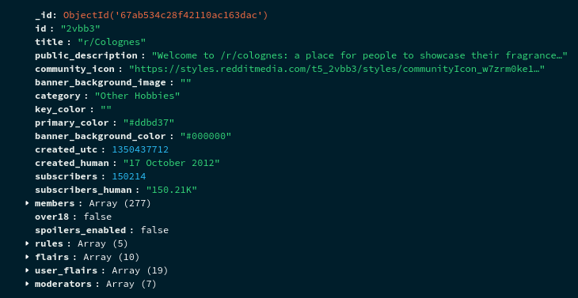
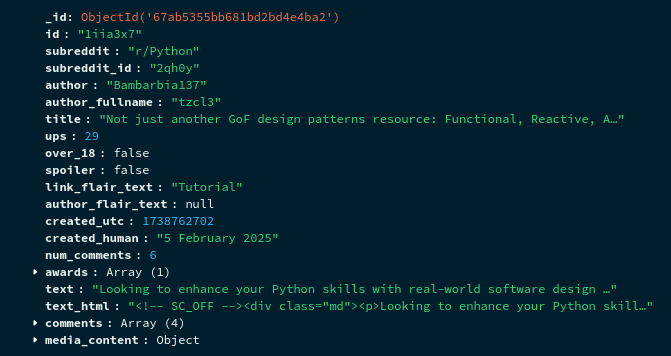
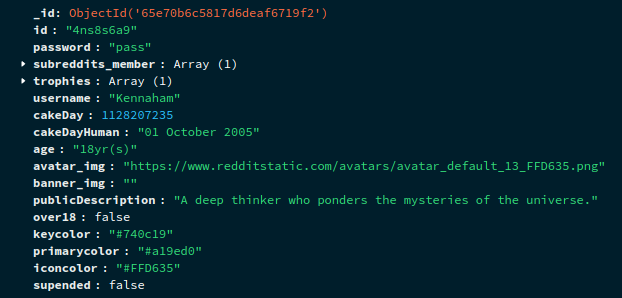

<p align="center">
<b>Reddit Scrapper</b>
</p>

<p align="center">

</p>

## Dependencies

-   Python 3.7+
-   Python dependencies listed in requirements files.

## Data scraped

Scrapes for following data and **outputs json data**:

Output will be stored in **directory named json**, it will be automatically
created after scraping is completed.

## Example Data

> A single Subreddit document look like this



> A single Post document look like this



> A single User document look like this



## Scripts Usage

-   **subreddits.py (Scrapes Subreddits)**
-   **posts.py (Scrapes Posts)**
-   **users.py (Scrapes Users)**
-   **utils/split.py (To make it easier to import JSON data into databases like MongoDB, this will split the data into smaller chunks of json files prefixed by users_p1,users_p2,... so on)**
-   **utils/import_data_to_mongodb.sh (Imports json data to MongoDB)**
-   **run.py (Runs all the above script one by one)**

## Running the Script

> Installing dependencies and activating a virtual environment

```sh
pip install virtualenv
git clone https://github.com/glowfi/reddit-scraper
cd reddit-scraper
python -m venv env
source ./env/bin/<Choose activation script Based on your OS>
pip install -r ./requirements
```

> Edit the env-sample and rename it into .env

```sh
username=<RedditUsername>
password=<RedditPassword>
client_id=<Get_it_from_reddit_api>
client_secret=<Get_it_from_reddit_api>
TOTAL_SUBREDDITS_PER_TOPICS = 6
SUBREDDIT_SORT_FILTER = "hot"
POSTS_PER_SUBREDDIT = 10
POSTS_SORT_FILTER = "new"
```

> Execute the script

```sh
./run.py
```
