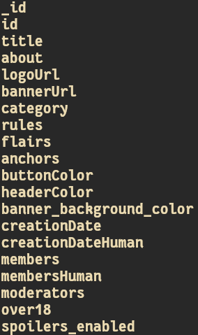
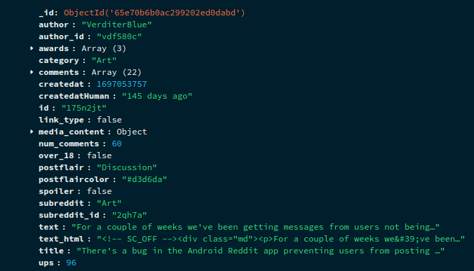
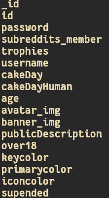

## Reddit Data Scrapper

> Scrapes data from reddit


## Dependencies

-   Python 3.7+
-   Python dependencies listed in requirements files.

## Data scraped

Scrapes for following data and **outputs json data**:

-   **subreddits**
-   **posts**
-   **users**

> Subreddits data



> Posts data



> Users data



## Scripts Usage

-   **subreddits.py (Scrapes Subreddits)**
-   **posts.py (Scrapes Posts)**
-   **users.py (Scrapes Users)**
-   **split.py (To make it easier to import JSON data into databases like MongoDB, this will split the data into smaller chunks of json files prefixed by users_p1,users_p2,... so on)**
-   **scrape.sh (Runs all the above script one by one)**

## Running the Script

> Installing dependencies and activating a virtual environment

```sh
pip install virtualenv
git clone https://github.com/glowfi/reddit-scraper
cd reddit-scraper
python -m venv env
source ./env/bin/<Choose activation script Based on your OS>
pip install -r ./requirements
```

> Edit the envTemplate and rename it into .env

**Try not to change the values everything after `POSTS_PER_SUBREDDIT` , as it is
optimized to deal with reddits rate-limiting with many api calls.
Ignore this if you are a paying customer**

```sh
username=<RedditUsername>
password=<RedditPassword>
client_id=<Get_it_from_reddit_api>
client_secret=<Get_it_from_reddit_api>
TOTAL_SUBREDDITS_PER_TOPICS=<Choose_your_desired_value>
POSTS_PER_SUBREDDIT=<Choose_your_desired_value>
TOPIC_SIZE=51
HITS_SUB=20
TIME_SUB=60
HITS_POSTS=15
TIME_POSTS=60
HITS_USERS=25
TIME_USERS=60
```

> Execute the script

```sh
./scrape.sh
```
