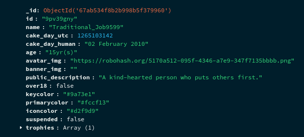

# Reddit Scraper

<p align="center">
  
</p>

A modular Reddit scraping tool that collects data about **subreddits**, **posts**, and **users**, and exports everything as structured **JSON** files for easy processing or database import.

---

## Features

- Scrapes:
    - Subreddits
    - Posts
    - Users

- Outputs clean, structured **JSON** data
- Includes tools to:
    - Split large JSON files into smaller chunks
    - Import JSON data into MongoDB

- Fully automated workflow via `run.py`

---

## Dependencies

- **Python 3.9+**
- Packages listed in `requirements.txt`

---

## Output Data Structure

> Sample JSON files are large (16-25MB each). Download them rather than viewing in browser.

### Subreddit Document Example


Sample JSON: [https://files.catbox.moe/r7a7um.json](https://files.catbox.moe/r7a7um.json)

### Post Document Example


Sample JSON: [https://files.catbox.moe/5cf2xw.json](https://files.catbox.moe/5cf2xw.json)

### User Document Example



Sample JSON: [https://files.catbox.moe/yp506n.json](https://files.catbox.moe/yp506n.json)

---

## Script Overview

| Script                            | Description                                         |
| --------------------------------- | --------------------------------------------------- |
| `subreddits.py`                   | Scrapes subreddit metadata                          |
| `posts.py`                        | Scrapes posts from each subreddit                   |
| `users.py`                        | Scrapes user information                            |
| `utils/split.py`                  | Splits large JSON files into import-friendly chunks |
| `utils/import_data_to_mongodb.sh` | Imports JSON chunks into MongoDB                    |
| `run.py`                          | Runs all scrapers sequentially                      |

---

## Installation & Setup

### 1. Clone the repository & create a virtual environment

```sh
pip install virtualenv
git clone https://github.com/glowfi/reddit-scraper
cd reddit-scraper

python -m venv env
source env/bin/activate   # Linux / macOS
# or: env\Scripts\activate  # Windows PowerShell

pip install -r requirements.txt
```

---

### 2. Configure environment variables

Edit the file **`env-sample`**, then rename it to **`.env`**:

```env
username=<RedditUsername>
password=<RedditPassword>
client_id=<Reddit API Client ID>
client_secret=<Reddit API Client Secret>

TOTAL_SUBREDDITS_PER_TOPICS=6
SUBREDDIT_SORT_FILTER="hot"
POSTS_PER_SUBREDDIT=10
POSTS_SORT_FILTER="new"
```

> Create your Reddit app at: [https://www.reddit.com/prefs/apps](https://www.reddit.com/prefs/apps)

---

### 3. Run the scraper

```sh
./run.py
```

This will:

1. Scrape subreddits
2. Scrape posts
3. Scrape users
4. Save all data in the output directory
5. (Optional) Split files for MongoDB import

---

## Importing Data Into MongoDB

After scraping, use the helper script:

```sh
./utils/import_data_to_mongodb.sh
```

Make sure your MongoDB service is running beforehand.

---

## Notes

- API limits apply; use reasonable configuration values
- Scraping speed depends on your network and Reddit API rate limiting
- JSON outputs are ready for further processing (ML, analytics, etc.)

---

## Contributing

Pull requests, issue reports, and improvements are welcome!
